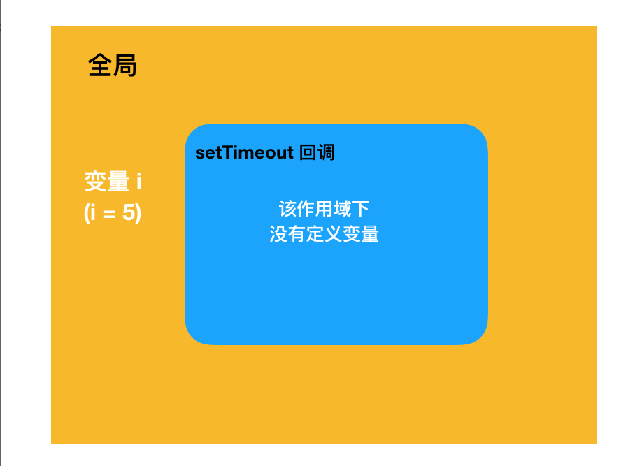
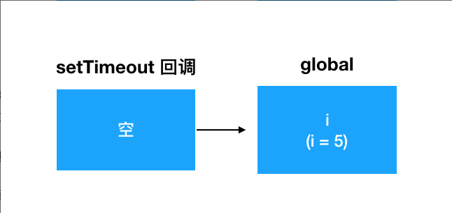
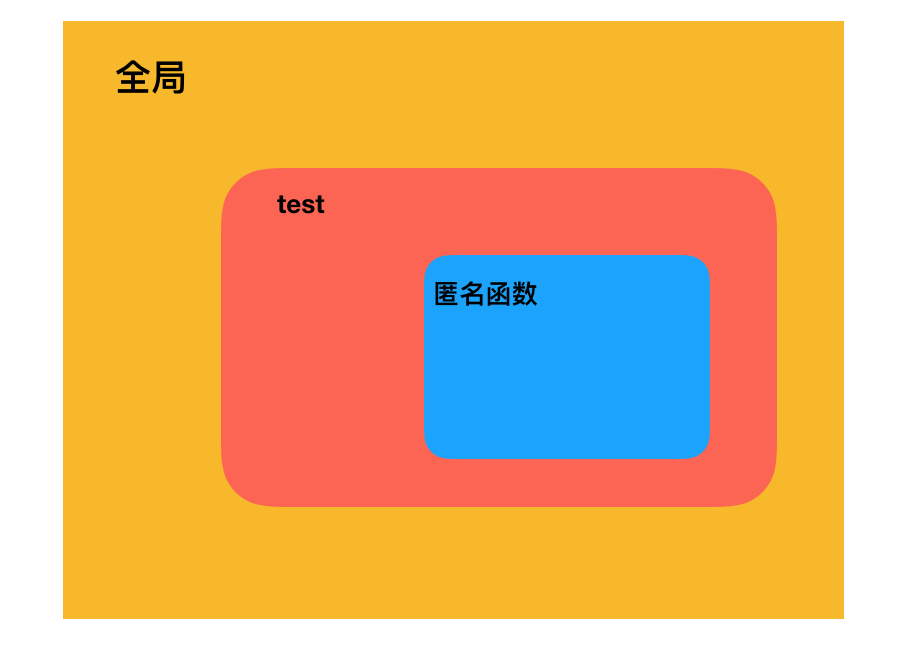
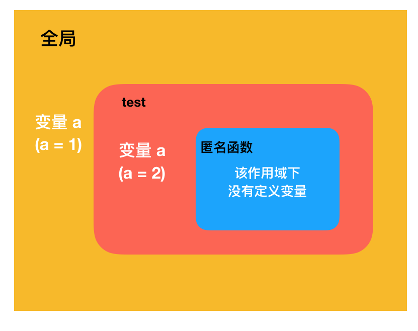
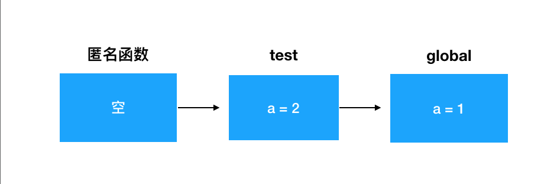

<style>
  .bgColor {
    border-radius：2px;
    background:#fff5f5;
    color:#ff502c;
    padding: .065em .4em
  }
</style>
<!-- <span class='bgColor'></span> -->
#### 如何理解JavaScript中的闭包
<span class='bgColor'>闭包</span>：有权访问另一个函数作用域中的变量的函数  
<span class='bgColor'>特性</span>：函数嵌套函数，内部函数可以引用外部函数的变量和参数；参数和变量不会被垃圾回收机制所回收  
<span class='bgColor'>优点</span>：变量长期存储在内存中；避免全局变量的污染；私有成员的存在   
<span class='bgColor'>缺点</span>：常驻内存，会加大内存的使用量，可能会造成内存泄漏

#### 代码理解闭包

```
  for (var i = 0; i < 5; i++) {
    setTimeout(function() {
        console.log(i);
    }, 1000);
  }

  console.log(i);
  // 输出 5 5 5 5 5 5
```
上面代码执行过程：在函数执行时，也就是1000ms后。它向上层作用域(全局作用域)去找变量i。此时for循环早已经执行完成，i的最终状态为5。所以1000ms后，当这个函数第一次真正被执行的时候，引用到的i值已经是5了。函数执行时整体的作用域状态示意如下



对应的作用域链关系如下：



接下来持续4次，每个1000ms，都会有一个一模一样的setTimeout回调被执行，输出的也是同一个全局i，所以每一次的输出都是5

#### 改变它的三种思路

> 第一种思路-使用setTimeout函数的第三个参数传入i

```
  for (var i = 0; i < 5; i++) {
    setTimeout(function(j) {
        console.log(j);
    }, 1000, i);
  }
```

> 第二种思路-在setTimeout上套一层函数，利用这个外部函数的入参来缓存每个循环中的i值

```
  var output = function (i){
    setTimeout(() => {
      console.log(i);
    }, 1000);
  }

  for (var i = 0; i < 5; i++) {
    output(i)
  }
```

第三种思路-在setTimeout上套一层立即执行函数

```
  for (var i = 0; i < 5; i++) {
    (function (j){
      setTimeout(() => {
      console.log(j);
      }, 1000);
    })(i)
  }
```

#### 闭包-循环体

```
  function test (){
    var num = []
    var i

    for (i = 0; i < 10; i++) {
        num[i] = function () {
            console.log(i)
        }
    }

    return num[9]
  }

  test()() // 输入 10

  var test = (function() {
    var num = 0
    return () => {
        return num++
    }
  }())

  for (var i = 0; i < 10; i++) {
    test()
  }

  console.log(test()) // 输出 10
```

#### 闭包-复杂作用域
<span class='bgColor'>解题思路步骤</span>
    
> step1: 读题

```
  var a = 1

  function test(){
    a = 2
    return function (){
      console.log(a);
    }
    var a = 3
  }

  test()()
```

> step2: 画图

  - 分层：从内向外画，最内层，是一个匿名函数。匿名函数的外层，是test函数的作用域，在外层，就是全局作用域了
  
  

  - 找变量：全局变量里的有a =1，最内层匿名函数里的a当前作用域不存在，主要需要分析test函数的a  
    1、<span class='bgColor'>变量提升</span>：test函数中，a =2在先，var a =3在后。但是函数作用域内部也是存在变量提升的，这个var会被提升到函数的顶部，所以test函数体等价于下面这种情况

    ```
      function test(){
        // 声明var被提前
        var a = 2
        return function (){
          console.log(a);
        }
        a = 3
      }
    ```

    2、<span class='bgColor'>作用域规则</span>：结合setp1里划分的层级和上一步分析出来test函数中的变量情况，可以看出匿名函数实际拿到的是a就是test函数作用域下的a。那么这个a是2还是3呢?  
    这里我们匿名函数被定义的时候a =3赋值动作还没有发生，因此它拿到的是2  
    作用域的划分，是在**书写的过程中，根据你把它写在哪个位置来决定的**。想这样划分出来的作用域，遵循的就是词法作用域模型  

    现在将分析出来的变量一个一个填进对应的地盘：  

    

    作用域链如下

    

#### 闭包的应用

> 模拟私有变量

> 偏函数与柯里化


