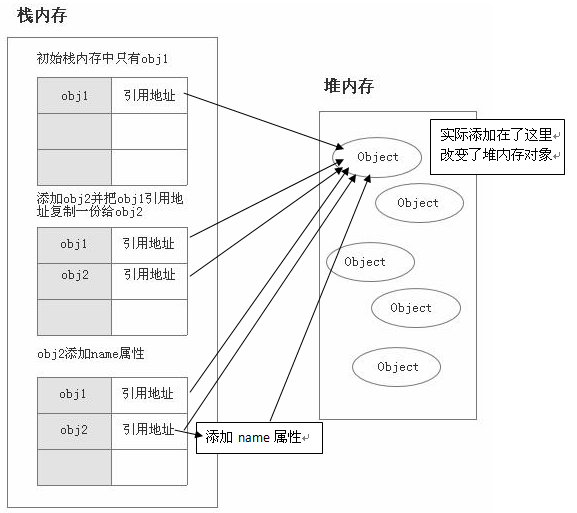

<style>
  .bgColor {
    border-radius：2px;
    background:#fff5f5;
    color:#ff502c;
    padding: .065em .4em
  }
</style>
<!-- <span class='bgColor'></span> -->
#### 数据类型
- 基本数据类型：String、Number、Boolean、Null、Undefined、Symbol、BigInt
- 引用数据类型：Object

> 基本数据类型和应用类型的区别
- 1、<span class='bgColor'>内存分配不同</span> 原始值是存储在栈(stack)中的简单数据段；引用值是存储在堆(heap)中的对象，也就是说存储在变量处的值是一个指针，指向存储对象的内存地址。
- 2、<span class='bgColor'>访问机制不同</span> 原始值可以直接访问到，引用值需要通过存储在栈空间中的引用地址去获取
- 3、<span class='bgColor'>赋值变量不同</span> 原始值赋值到新变量时会在栈内存中新开辟一个空间来存储新值，新旧两值互不影响；原始值赋值时实际上赋予的是该对象的引用指针，新旧对象共用同一个引用指针，属性方法共用。
- 4、<span class='bgColor'>参数传递不同</span> 原始值只是把变量的值传递给参数，之后参数和这个变量互不影响；引用值传递给参数的值是这个对象变量指向堆内存中数据实体的内存地址。函数内部修改参数，外部的对象也会受影响。





#### 判断数据类型方法
> typeof 只适合判断基础类型数据类型
- 基础类型除null以外，返回正常结果
- 引用类型除function一危，一律返回object类型
- null，返回object类型，function返回function类型

```
  typeof null         // object
  typeof {}           // object
  typeof []           // object
  typeof ''           // string
  typeof true         // boolean
  typeof 1            // number
  typeof Symbol()     // symbol
```

> instanceof


> toString


#### 数据类型转换
> string
> boolean
> number
总结


