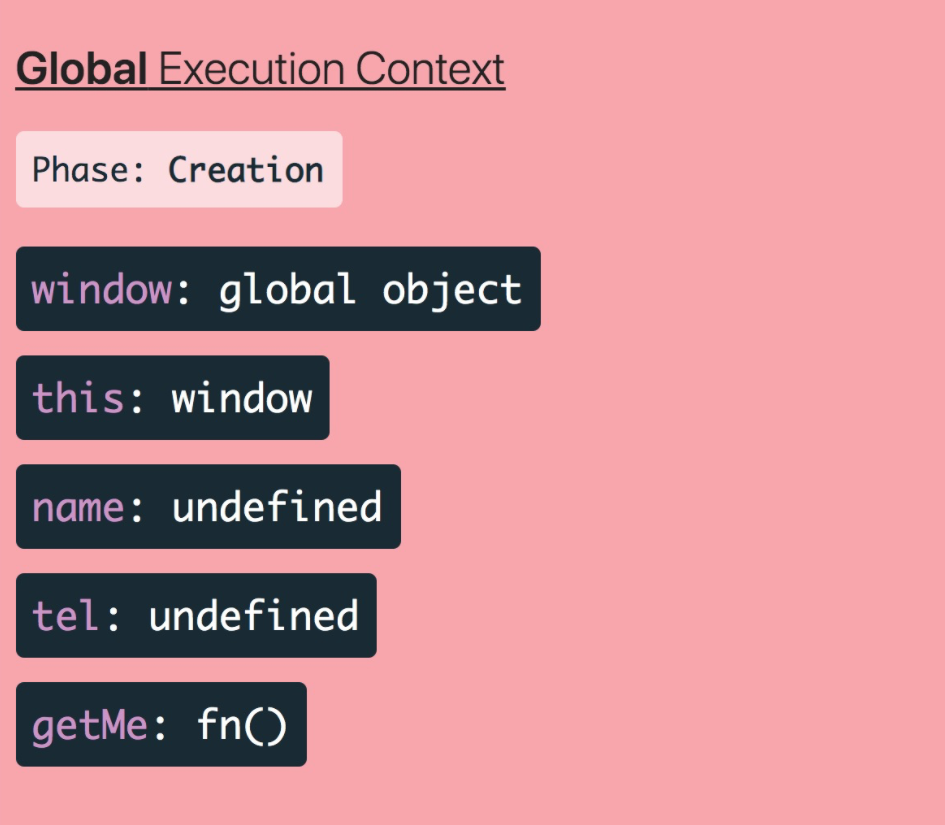
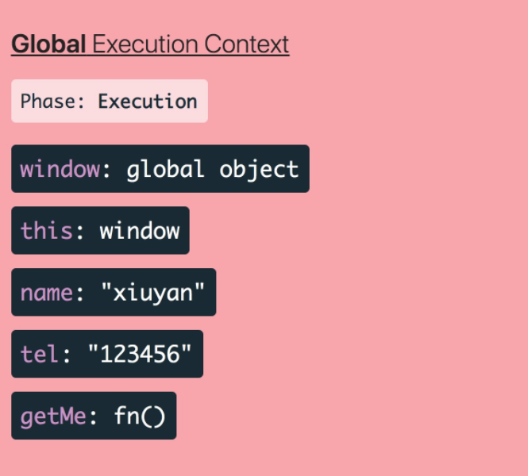
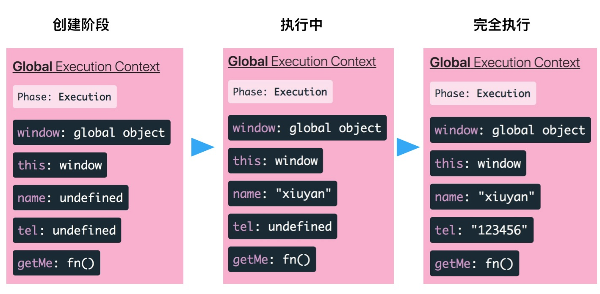
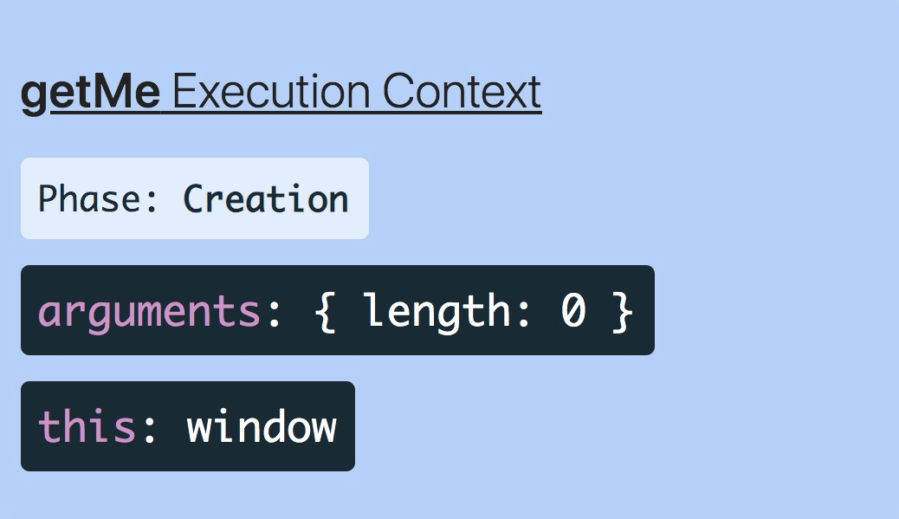
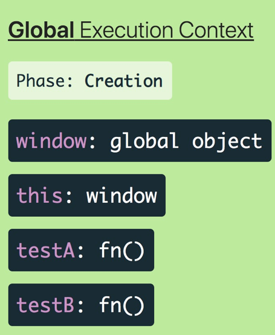
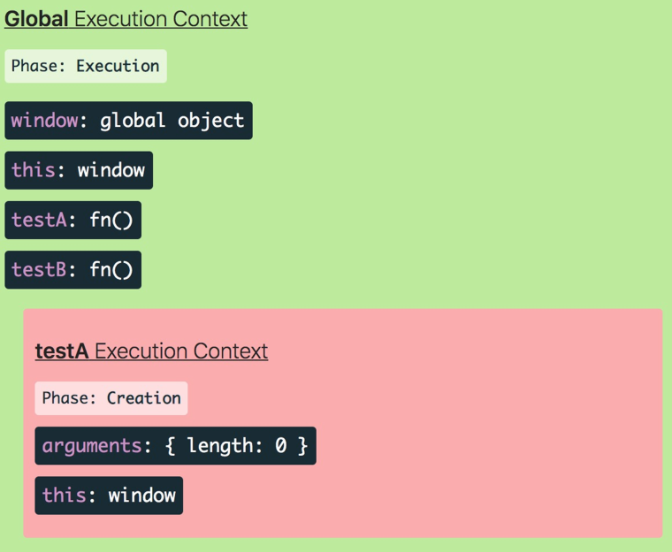
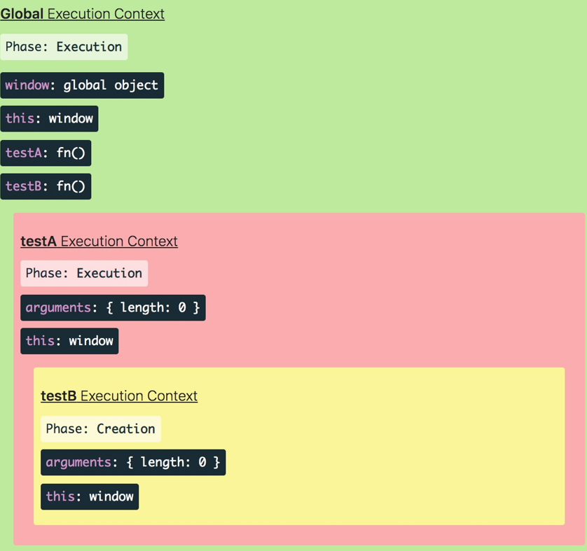
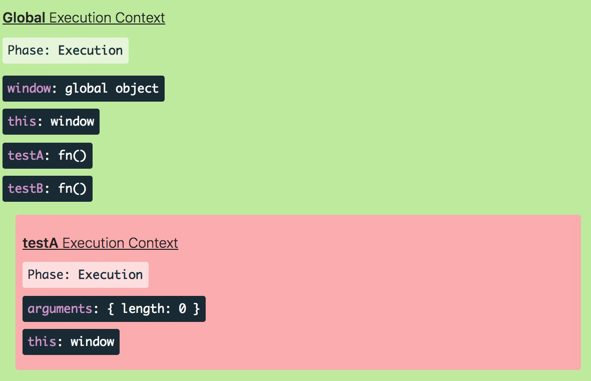
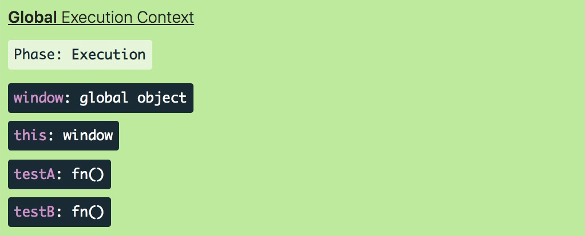
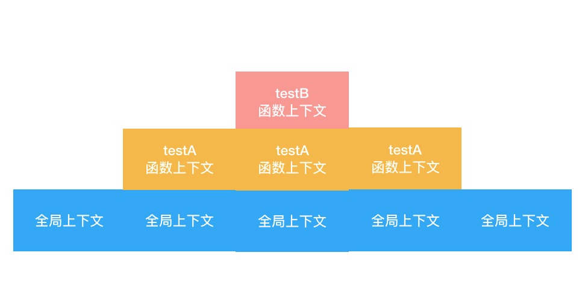

<style>
  .bgColor {
    border-radius：2px;
    background:#fff5f5;
    color:#ff502c;
    padding: .065em .4em
  }
</style>
<!-- <span class='bgColor'></span> -->
#### 为什么要有执行上下文
我们可以把执行上下文理解为引擎在执行过程中对代码进行了又一次的'划分'，这样做的目的是为了分解复杂度

#### 执行上下文是什么
执行上下文，从定义上理解，是'执行代码的环境'—— 这是一个专业且抽象的定义。从学习的层面来说，可以从执行上下文的分类、组成、生命周期函数等具体的维度来理解它

> 执行上下文的分类

 - 全局上下文，全局代码所处的环境，不在函数中的代码都在全局上下文中
 - 函数上下文，在函数调用时创建的上下文
 - Eval执行上下文，运行Eval函数中的代码所创建的环境

> 全局上下文的创建和组成

当我们的js脚本跑起来的时候，第一个被创建的执行上下文就是全局上下文  
当我们的js脚本一行代码都没有的时候，全局上下文比较干净，只有两样东西：
 - 全局对象(浏览器：window，node：global)
 - this变量(this指向：全局变量)

```
  var name = 'xiaozhang'
  var tel = '123456'

  function getMe (){
    return {
      name,
      tel
    }
  }
```



在上面代码中，可以看见name和tel都赋值了，但还是undefined。这是因为每个执行上下文都会经历这样的生命周期函数

- 创建阶段，执行上下文的初始化状态，此时一样代码都还没有执行，只是做了一些准备工作  
  1、创建全局对象（window有了）  
  2、创建this，并让它指向全局对象  
  3、给变量和函数安排内存空间  
  4、默认给变量赋值为undefined；将函数声明放入内存  
  5、创建作用域链  


- 执行阶段，逐行执行脚本里的代码

 

这时可以看到该有的值都有了值，这时因为js引擎已经在一行一行执行代码、执行赋值操作了  

<span class='bgColor'>注意</span>：执行上下文在执行阶段其实始终是处在一个动态，比如执行完一行没有执行第二行的时候，这时候就只有name有值，而tel还是undefined；在往下执行一行tel也有值了，就会看到执行上下文的内容又变了(从创建到执行完成过程如下图)



##### 站在上下文的角度，理解'变量提升'的本质

```
  console.log(name) // xiaozhang
  var name = 'xiaozhang'
```

在上面代码中，js引擎不会抛出变量为声明的错误，而是输出一个undefined的值，表现得好像这个name已经声明过了一样。像这样的现象，叫做'变量提升'  
在结合执行上下文的过程中，其实可以分析出根本不存在'提升'，变量一直在原地。所谓的'提升'，只是变量的创建过程(在上下文创建阶段完成)和真实赋值过程(在上下文执行完成)的不同带来的一种错觉。执行上下文在不同阶段完成的不同工作，才是'变量提升'的本质

> 函数上下文的创建和组成

函数上下文的机制层面和全局上下文高度一致，只需要关注它与全局上下文之间的不同即可。两者之间的不同主要体现在以下方面
  - 创建的时机，全局上下文在进入脚本之处就被创建，而函数上下文则在函数调用时被创建
  - 创建的频率，全局上下文仅在代码刚开始被解释的时候创建一次，而函数上下文由脚本里的函数调用的多少决定，理论上可以创建无数次
  - 创建阶段的工作内容不完全相同，函数上下文不会创建全局对象（window），而是创建参数对象（arguments）；创建出的this不再死死指向全局对象，而是取决于该函数是如何被调用的，如果它被一个引用对象调用，那么this指向这个对象；否则this的值会被设置为全局对象或undefined（严格模式下）

```
  var name = 'xiaozhang'
  var tel = '123456

  function getMe(){
    return {
      name,
      tel
    }
  }

  getMe()
```

当js引擎执行到getMe()这一行，首先会进入函数上下文的创建阶段，在这个阶段里，函数上下文的内容如下



接着进入执行阶段，逐行执行函数内部的代码。此处我们只有一行代码，在执行过程没有涉及到变量的修改，因此函数上下文的内容保持不变。执行完毕后，函数上下文的生命周期就结束了

#### 调用栈
我们看到函数执行完毕后，其对应的执行上下文也随之消失了。这个消失的过程，叫做'出栈'，在js代码的执行过程中，引擎会为我们创建'执行上下文栈'（也叫调用栈）  

因为函数上下文可以有许多个，我们不可能保留所有的上下文。当一个函数执行完毕后，其对应的上下文必须让出之前所占有的资源，因此上下文的建立和销毁，就对应了一个'入栈'和'出栈'的操作。当我们调用一个函数的时候，就会把它的上下文推入调用栈里，执行完毕后出栈，随后再为新的函数进行入栈操作  

```
  function testA() {
    console.log('执行第一个测试函数的逻辑');
    testB();
    console.log('再次执行第一个测试函数的逻辑');
  }

  function testB() {
   console.log('执行第二个测试函数的逻辑');
  }

  testA();
```

以上这个脚本的执行上下文栈，随着代码的执行，会经历以下过程

- 1、创建之初，全局上下文创建



- 2、执行到testA调用处，testA对应的函数上下文创建



- 3、执行到testB调用处，testB对应的函数上下文创建



- 4、testB执行完毕，对应上下文出栈，剩下testA和全局上下文



- 5、testA执行完毕，对应上下文出栈，剩下全局上下文



在这整个过程中，调用栈的变化示意如下:



#### 站在调用栈的角度，理解作用域的本质

作用域是访问变量的一套规则，其实也是当前所处的执行上下文

> 作用域对外隔离

```
  function testA() {
    console.log('执行第一个测试函数的逻辑');
    testB();
    console.log('再次执行第一个测试函数的逻辑');
  }

  function testB() {
    console.log('执行第二个测试函数的逻辑');
  }

  testA();
```

这里，全局作用域 相对与testA的函数作用域，它是外部作用域；全局作用域、testA相对于testB的函数作用域，它们都是外部作用域。作用域在嵌套的情况下，外部作用域是不能访问内部作用域的变量的。在结合调用栈的情况，可以分析出其中的原因：


以testB为例，可以看到，最初处于外部作用域（testA，全局上下文）时，testB对应的上下文还没有推入调用栈；而当testB执行结束，代码执行退回外部作用域时，testB早已从栈顶弹出，这意味着，每次位于外部作用域时，testB的执行上下文都压根不存在于调用栈内。此时testA和全局上下文无论如何都找不到任何关于testB的线索，自然访问不到它内部的变量了

> 闭包，特殊的'弹出'

```
  function outer(a){
    return function (b){
      return a + b;
    }
  }

  var addA = outer(1)

  addA(2)
```

在上面代码中，inner函数中引用了outer函数的自由变量a变量，形成了一个闭包。在outer函数执行完毕出栈后，实际上inner仍然可以访问到这个a变量，a变量并没有随着outer函数执行上下文的消失而消失，这是因为在执行上下文的创建阶段，跟着被创建的还有作用域链，这个作用域链在函数中以内部属性的方式存在，在函数定义时，其对应的父变量对象就会被记录到这个内部属性中，闭包正是通过这一层作用域链的关系，实现了对父作用域执行上下文信息的保留

> 自由变量的查找-作用域链与上下文变量的结合

```
  var name = 'xiuyan'

  function testA() {
    console.log('执行第一个测试函数的逻辑');
    testB();
    console.log('再次执行第一个测试函数的逻辑');
  }

  function testB() {
    console.log(name);
  }

  testA();
```

在之前讲了外部作用域难以'触及'内部作用域的原因，但反过来，站在函数作用域内部，却可以访问到外部作用域的变量，这是因为当代码执行到testB这个位置时，它位于调用栈的栈顶，此时testA和全局变量都在调用栈的栈底；  

在执行阶段，如果像例子中的testB一样，在函数作用域内部查不到name变量，name引擎会沿着作用域链往上找，定位到它对应的父级作用域的上下文，看有没有目标变量，如果还没有就沿着作用域链继续往上定位，直到找到为止  

注意：这里的沿着作用域找，可不是沿着调用栈一层一层往上找；调用栈是在执行的过程中形成的，而作用域链可是书写阶段就决定好了，因此testB里找不到的变量，绝不会去testA里找，而是去全局上下文变量查找


