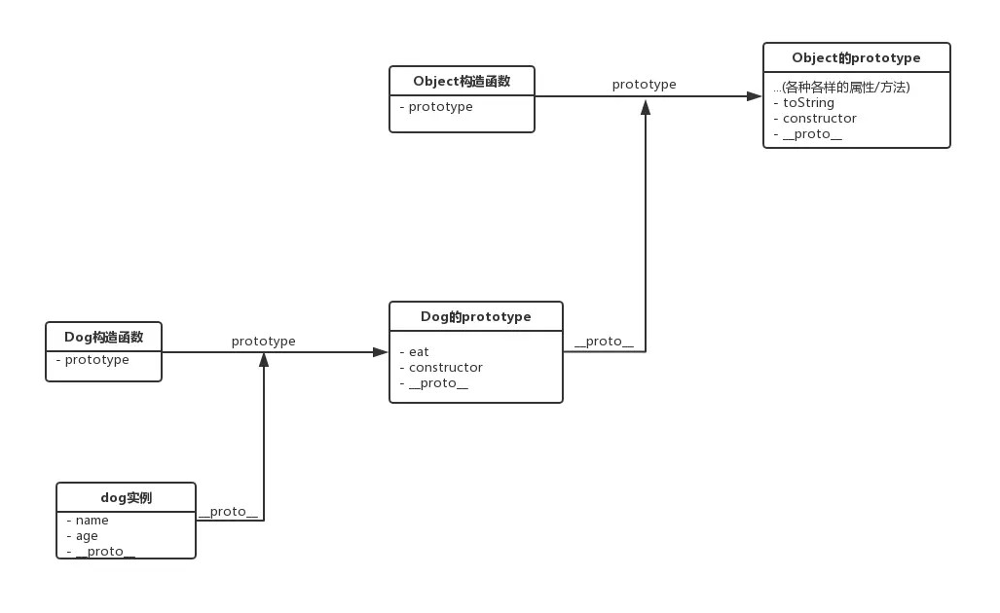

<style>
  .bgColor {
    border-radius：2px;
    background:#fff5f5;
    color:#ff502c;
    padding: .065em .4em
  }
</style>
<!-- <span class='bgColor'></span> -->
#### 理解原型和原型链
原型编程范式的核心思想就是<span class='bgColor'>利用实例来描述对象，用实例作为定义对象和继承的基础</span>。在JavaScript中，原型编程范式的体现就是<span class='bgColor'>基于原型链的继承</span>，这其中，对原型，原型链的理解是关键

#### 原型
在JavaScript中，每个构造函数都拥有一个prototype属性，它指向构造函数的原型对象，这个原型对象中有个construtor属性指回构造函数；每个实例都有一个__proto__属性，当使用构造函数去创建实例时，实例的__proto__属性就会指向构造函数的原型对象

```
  function Dog (name, age){
    this.name = name;
    this.age = age;
  }

  Dog.prototype.eat = function (){
    console.log('eat');
  }

  const dog = new Dog('wangcai', 3)
```

这段代码里的几个实体之间就存在这样的关系


#### 原型链

```
  dog.eat() // eat
  dog.toString() // [object Object]
```

在dog实例中并没有eat和toString方法，，但它们还是被成功地调用。这是因为当我试图访问一个JavaScript实例的属性/方法时，它首先搜索这个实例本身；当发现实例没有定义对应的属性/方法时，它会转而搜索实例的原型对象；如果原型对象中也搜索不到，它就回去搜索原型对象的原型对象，这个搜索的轨迹，叫做原型链

以我们的eat和toString方法的调用过程为例，它的搜索过程就是这样子的：



上面这些彼此相连的prototype，就构成了原型链

<span class='bgColor'>注：</span>几乎所有JavaScript中的对象都是位于原型链顶端的Object的实例，除了Object.prototype（当然，如果手动调用Object.create(null)创建一个没有任何原型的对象，那它也不是Object的实例）
