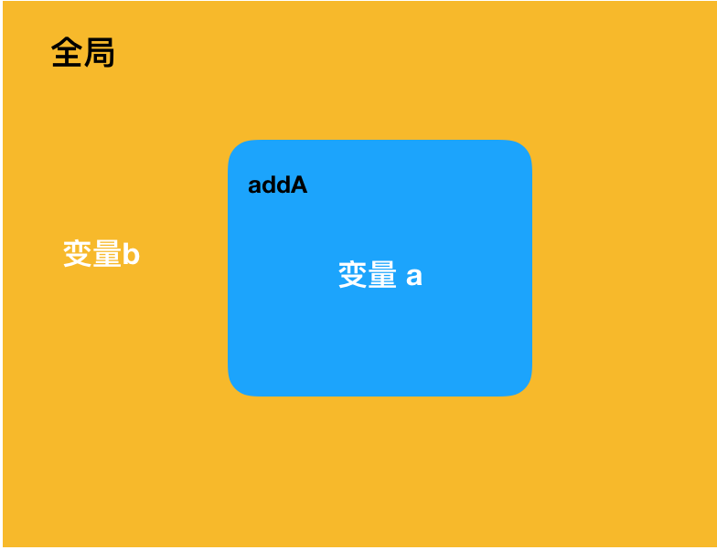
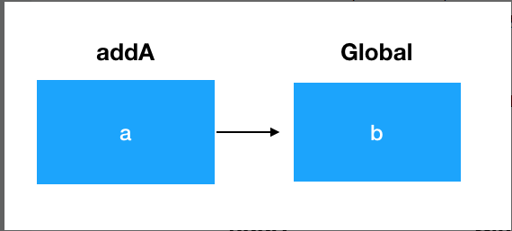

#### 作用域是什么
作用域是访问变量，存储变量的一套规则，能够存储变量当中的值，并且允许我们对这个变量的值进行访问和修改。

#### 理解作用域实现机制(结合js的编译原理)

```
  var name = 'zrp'
```

上面代码中，js引擎包含两个声明
- var name (编译时处理)
- name = 'zzp' (运行时处理)  
js也是有编译阶段的，和传统语言的区别在于，js不会早早的把编译工作做完，而是一边编译一边执行，所有js代码片段都会在执行之前被编译，只是这个编译阶段过程非常
短暂，紧接着这段代码就会被执行  

在上面代码中，编译阶段和执行阶段会如下运行
- 编译阶段：编译器会找遍当前作用域，看是否有name，如果有，则忽略var name 这个声明，继续编译下去；如果没有，则在当前作用域新增一个name。然后编译器会为
引擎生成运行时所需要的代码，程序进入执行阶段

- 运行阶段：js引擎在执行代码时，仍会找遍当前作用域，看看是否有name，如果有则进行赋值。如果找不到它会从当前作用域‘探出头去’，看看‘外面’或者‘外面的外面’有没有。
如果最终仍没有找到name变量，引擎就会抛出一个异常

#### 三大作用域

> 全局作用域  

 声明在任何函数之外的顶层作用域的变量就是全局作用域，这样的变量拥有全局作用域

```
  var name = 'zzp'
  // 函数作用域
  function showName (){
    console.log(name);
  }
  // 块作用域
  {
    name = 'abc'
  }

  showName() // 'zzp'
```

> 函数作用域  

在函数内部定义的变量，拥有函数作用域

```
 var name = 'zrp'
  function showName(myName){
    console.log(myName);
  }

  function sayHello(){
    var helloString = 'hello'
    console.log(helloString);
  }

  showName(name)              // 'zzp'
  showName()                  // 'hello'
  console.log(myName);        // 抛出错误，myName在全局作用域未定义
  console.log(helloString);   // 抛出作物，helloString在全局作用域未定义

  {
    console.log(myName, helloString);  // 抛出错误
  }
```

> 块作用域

在ES6中，新增两个声明变量的关键字let和const。这两个关键字定义的变量，如果被大括号{}这样括株，那么这个大括号就是一个代码块，大括号括住的这些变量就形成了一个块作用域

在下面代码中可以看出，块作用域的变量只要出了自己被定义的那个代码块，就无法访问，和函数作用域相似，只在自己的‘地盘’有效，也被称为局部作用域

```
  {
    let a = 1
  }

  console.log(a) // 报错

  function showA(){
    console.log(a); // 报错
  }
```

#### 作用域链
作用域链是指当一个块或者一个函数嵌套在另一个块或者函数中，就发生了作用域的嵌套

```
  function addA(a){
    console.log(a + b); // 3
    console.log(c);     // 报错
  }

  var b = 1
  addA(2)
```

在上面例子中，有两个作用域，addA的函数作用域和全局作用域，他们的关系如下：



我们试图在addA这个函数里访问变量b的时候，考虑到函数作用域内并没有对b、c这两个变量作定义，所以在函数作用域中找不到，就向上层作用域(全局作用域)查找，找到了b，拿来直接使用；但没有找到c，并且全局作用域已经没有上层作用域了就会报错。  

在这个查找过程中，层层递进的作用域，就形成了一条作用域链。


