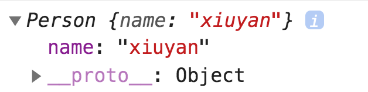
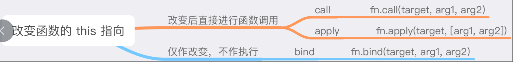

<style>
  .bgColor {
    border-radius：2px;
    background:#fff5f5;
    color:#ff502c;
    padding: .065em .4em
  }
</style>
<!-- <span class='bgColor'></span> -->

#### this 基本指向原则解析
> this 指向谁？

多数情况下，this指向调用它所在的方法的那个对象  
简单的来说就是，谁调的函数，this就归谁。当调用方法没有明确对象，this就指向全局对象。在浏览器中，指向window；在Node，指向Golbal  
<span class='bgColor'>this的指向是在调用时决定的，而不是在书写时决定的。与闭包恰恰相反</span>  

> 区分'声明位置'与'调用位置'

js是词法作用域模型，无论是一个对象也好，一个方法也好，它的生命周期只和声明它的位置有关。我把它写在那个位置，它就活在哪个位置

```
  // 声明位置
  var me = {
    name: 'xiaozhang',
    hello: function (){
      console.log(`你好，我是${this.name}`)
    }
  }

  var you = {
    name: 'xiaoming',
    hello: me.name
  }

  // 调用位置
  me.hello(); // xiaozhang
  you.hello() // xiaoming
```

在代码中，me和hello被调用了，因此两次调用的this也就分别指向了me和you

```
  // 声明位置
  var me = {
    name: 'xiaoming',
    hello: function (){
      console.log(`你好，我是${this.name}`)
    }
  }

  var name = 'xiaozhang'
  var hello = me.hello  

  // 调用位置
  me.hello(); // xioaming
  hello();  // xiaozhang
```

在代码中，直接调用了hello，输出了quanju的name变量，可以理解为name和hello都挂在在全局对象window上，所以hello（）等价于window.hello()，此时hello方法内部的this自然指向window

```
  // 声明位置
  var me = {
    name: 'xiaoming',
    hello: function (){
      console.log(`你好，我是${this.name}`)
    }
  }

  var you = {
    name: 'xiaozhang',
    hello: function (){
      var targetFunc = me.hello
      targetFunc()
    }
  }

  var name = 'xiaojiang'

  // 调用位置
  you.hello() //  xiaojinag
```

#### 特殊情境下的this指向
在三种情境下，this会100%指向window
  - 立即执行函数(IIFE)
  - setTimeout中传入的函数
  - setInterval中传入的函数

> 立即执行函数

```
  var name = 'xiaoming'

  var me = {
    name: 'xiaozhang',
    // 声明位置
    sayHello: function (){
      console.log(`你好，我是${this.name}`)
    },
    hello: function (){
      (function (cd){
        cd()
      })(this.sayHello)
    }
  }

  me.hello() // 你好，我是xiaoming
```

> setTimeout和setInterval中传入的函数

```
  var name = 'xiaozhang'

  var me = {
    name: 'xiaoyu',
    hello: function (){
      setTimeout(function (){
        console.log(`你好，我是${this.name}`);
      })
    }
  }

  me.hello() // 你好，我是xiaozhang
```

#### 严格模式的this
严格模式确实在一些情况下会导致this指向undefined，但并非总是如此。

```
  'use strict'

  function showThis() {
    console.log(this)
  }

  showThis() // undefined
```

在上面代码中，this将保持它被指定的那个对象的值，所以，如果没有指定对象，this就是undefined

```
 'use strict'
  console.log(this) // 直接在全局代码里尝试去拿 this
```

```
  'use strict'
  var name = 'xiaozhang'
  
  var me = {
    name: 'xiaoyun',
    hello: function (){
        // 全局作用域下实现的函数
        setTimeout(function (){
          console.log(`你好，我是${this.name}`) 
        });
    }
  }

  me.hello() // 你好，我是xiaozhang
```

像这样处于全局代码中的this，不管它是否处于严格模式下，它的this都指向window，（注意：区分度非常高，并不是见到‘use strict’，this就是undefined）

#### 箭头函数

箭头函数中的this比较特别，它与严格模式，非严格模式没有什么关系。与闭包相似，都是认'词法作用域'的。所以说箭头函数中的this，与如何调用它无关，而是由你书写它的位置决定的

```
  var name = 'xiaozhang'

  var me = {
    name: 'xiaoyan', 
    // 声明位置
    hello: () => {
      console.log(this.name);
    }
  }

  // 调用位置
  me.hello() // xiaozhang
```

在上面代码中，因为this在书写的时候，它所在的作用域是全局作用域，于是这个this就和全局对象绑定在了一起  
理解箭头函数的this指向规则，和理解普通函数的指向规则，需要的是两套完全相反的脑回路。普通函数this指向是在调用时决定的，箭头函数this指向是在书写它的位置决定的


#### 改变this指向
  - 通过改变书写代码的方式做到（箭头函数）
  - 显式地调用一些方法(apply,call,bind)

> 改变书写代码的方式，进而改变this指向(箭头函数)

```
  var a = 1;

  var obj = {
    a: 2,
    hello: () => {
      console.log(this.a)
    }
  }

  // 调用位置
  obj.hello() // 1
```

当我们将普通函数改写为箭头函数时，箭头函数的this会在书写阶段(即声明位置)就绑定到它父作用域的this上。无论后续如何调用它，都无法再为它指定目标对象，因为箭头函数的this指向是静态的，'一次便是一生'

> 构造函数里的this

当我们使用构造函数去new一个实例的时候：

```
  function Person (name){
    this.name = name
    console.log(this);
  }

  var person = new Person('xiaozhang')
```
构造函数里面的this会绑定到我们new出来的这个对象上



> 显示地调用一些方法来绑定  


- call和apply和bind都是用来改变函数的this指向的
- call和apply和bind之间的区别比较大，前者在改变this指向的同时，也会把目标函数给执行掉；后者则只会负责改变this，不做任何执行操作
- call和apply之间的区别，体现在对传参的要求。前者只需要把目标函数的入参逐个传入即可，后者则希望以数组形式传入

> call方法模拟

以call的表现出来的特性，我们只是能想到两点
 - 改变this指向，将this绑到第一个入参指定的对象上去
 - 根据输入的参数，执行函数

```
  Function.prototype._call = function (context, ...args){
    context = context || window;
    context.func = this;
    context.func(...args);
    delete context.func;
  }
```

> apply方法模拟

apply方法与call方法相似，区别在于目标函数的参数传入形式不同，前者以数组行驶传入，后者的入参逐个传入

```
  Function.prototype._apply = function (context, args){
    context = context || window;
    context.func = this;
    context.func(...args);
    delete context.func;
  }
```

> bind方法模拟

bind方法与call和apply方法区别在于，前者仅改变this指向不做任何执行操作，后者则会改变this指向时，会有执行操作

```
  Function.prototype._bind = function (context, ...args){
    let self = this;
    return function (){
      self.apply(context, args)
    }
  }
```


